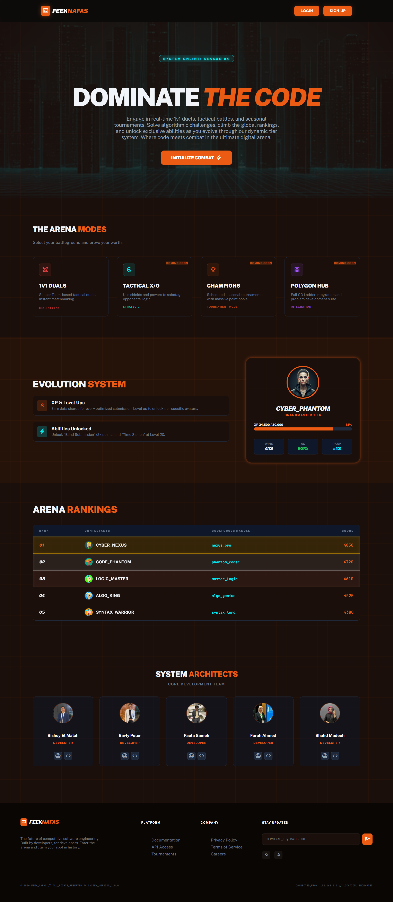
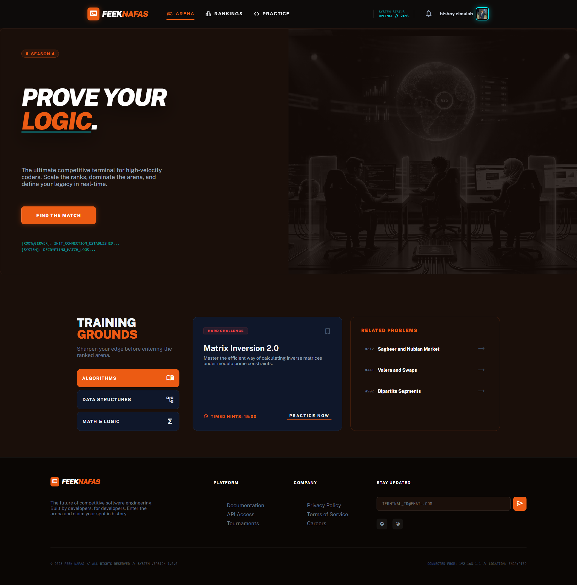
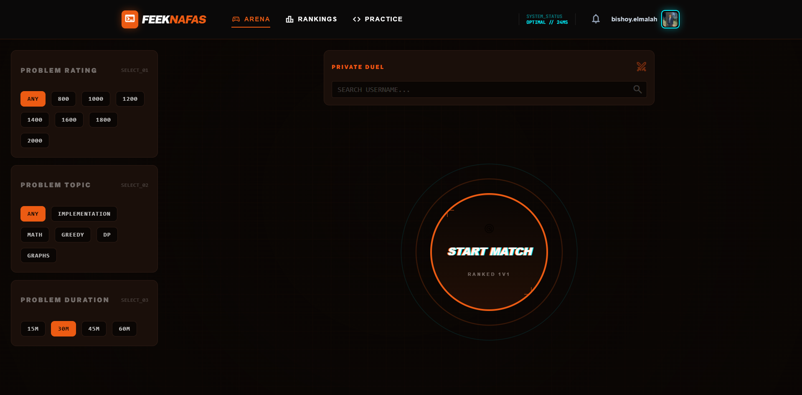
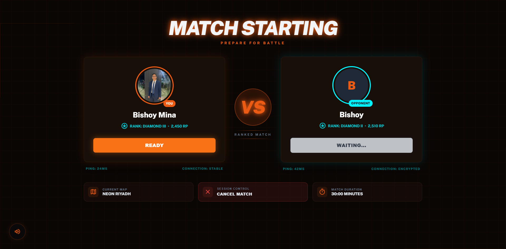
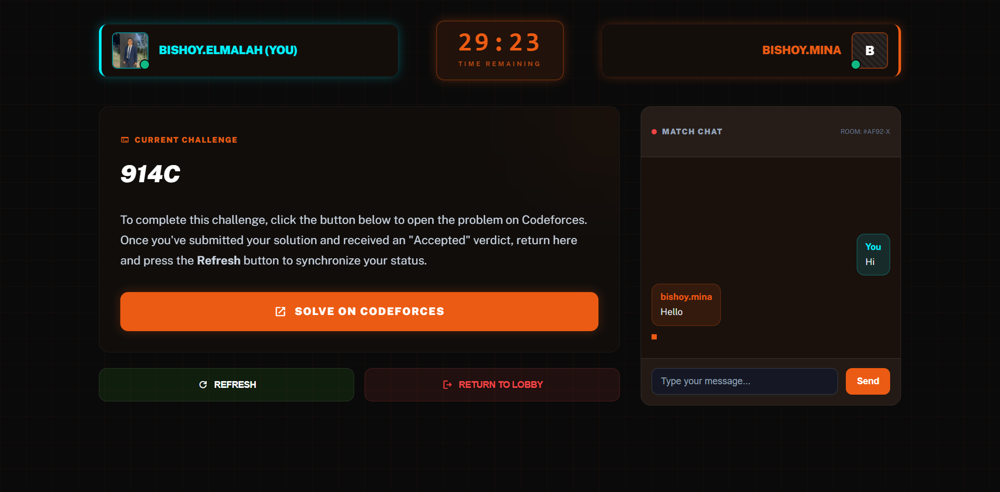
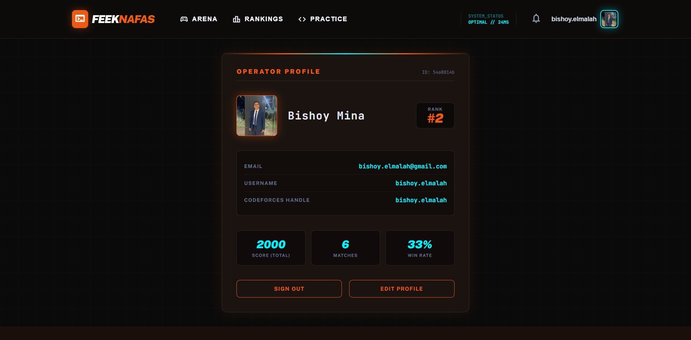

# ⚔️ Feek Nafas
> **The E-Sports of Competitive Programming.**

**Feek Nafas** (Arabic for *"Do you have breath/stamina?"*) is a real-time competitive programming platform that turns algorithm solving into a high-stakes head-to-head battle. Inspired by "Lockout" matches, it allows developers to compete 1v1 or in teams to solve Codeforces problems faster than their opponents.

Unlike traditional contests, **Feek Nafas** focuses on the adrenaline of live, direct competition with a cyberpunk, gamified UI.

---

## 📸 Gallery
| **Landing Page** | **Home Page** |
|:---:|:---:|
|  |  |

| **Find Match** | **Get Ready Lobby** |
|:---:|:---:|
|  |  |

| **Match Arena** | **Profile Page** |
|:---:|:---:|
|  |  |

---

## 🚀 Key Features

* **1v1 Real-Time Battles:** Challenge a friend or get matched instantly. First to solve wins.
* **Live Scoreboard:** Real-time updates using Supabase Realtime. See your opponent's status instantly.
* **Fair Play Referee:** Server-side validation (Refreshed via user action or Edge Functions) ensures no client-side cheating.
* **Smart Matchmaking:** Filters problems by rating (800 - 3000) from Codeforces.
* **Interactive HUD:** Cyberpunk-styled interface with live timers, problem details, and chat.
* **Immersive Audio:** Game sounds for notifications, match starts, and victories.
* **User Profiles & Leaderboards:** Track your wins, losses, and global rank.

---

## 🛠️ Tech Stack

This project uses a modern, serverless architecture to ensure speed and scalability.

### **Frontend**
* **Framework:** [React](https://react.dev/) (v18+)
* **Build Tool:** [Vite](https://vitejs.dev/) (with **SWC** for speed)
* **Language:** [TypeScript](https://www.typescriptlang.org/)
* **Styling:** CSS Modules / Custom Cyberpunk Design System

### **Backend (BaaS)**
* **Database:** [Supabase](https://supabase.com/) (PostgreSQL)
* **Real-Time:** Supabase Realtime (WebSockets for game state)
* **API Logic:** Supabase Edge Functions (Deno/TypeScript) - *Acts as the secure Referee.*

### **External APIs**
* **Codeforces API:** Used to fetch problem sets and check user submission verdicts.

---

## 🧠 Core Logic & Services

### **1. Real-Time Invitation System**
- Users listen to a private **Supabase Realtime** channel for invitations.
- When an opponent challenges you, a notification appears with options to **Accept** or **Decline**.
- Status updates (`Pending`, `Accepted`, `Declined`) are managed through the `Matches` table.

### **2. Presence-Based Lobby**
- Once a match is accepted, both players enter the **Get Ready Lobby**.
- A "Ready" status is tracked for both. When both are ready, a countdown starts, and the match begins.

### **3. Secure Referee Logic**
- The app polls the **Codeforces API** to verify submissions.
- When a player solves the problem, the state is updated globally.
- Matches can end in **Victory**, **Loss**, or a **Draw** if the timer expires.

---

## 🗺️ Application Map

- **Landing:** The cyberpunk intro to the arena.
- **Auth:** Login and Register pages integrated with Supabase Auth.
- **Home:** Main hub to start matches or view stats.
- **Find Match:** Search for users and send invitations.
- **Get Ready:** The pre-match lobby for synchronized starts.
- **Match Arena:** The core competition page with problem links and live timer.
- **Leaderboard:** Compete for the top spot globally.
- **Profile:** Track your performance and personal stats.
- **Settings:** Customize your experience.

---

## 🔮 Roadmap

- [x] Basic 1v1 Match Logic
- [x] User Authentication (Supabase Auth)
- [x] Real-time Invitation System
- [x] Leaderboards & Global Rankings
- [ ] Elo/Rating System
- [ ] "Spectator Mode" for live viewing
- [ ] Team Battles (2v2)
- [ ] Sound effects and haptic feedback

---

## 🤝 Contributing

Contributions are welcome!
1.  Fork the project.
2.  Create your feature branch (`git checkout -b feature/AmazingFeature`).
3.  Commit your changes (`git commit -m 'Add some AmazingFeature'`).
4.  Push to the branch (`git push origin feature/AmazingFeature`).
5.  Open a Pull Request.

---

## 📜 License

Distributed under the MIT License. See `LICENSE` for more information.

---

**Built with ❤️ and ☕**